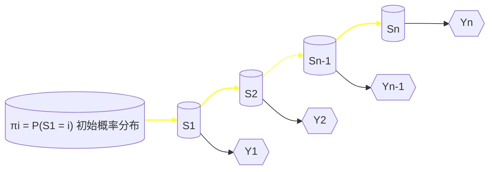

# 人工智能现代方法：机器学习

- [Intro.（一些琐碎的东西）](#intro)
- [ML Basics（一份漫游指南 &amp; 一份缩略图）](#ml-basics)
- [Linear Models](#linear-models)
- [Kernel Methods &amp; SVM](#kernel-methods-svm)
- [Bayesian Classification &amp; Probabilistic Graphical Models](#bayesian-classification-&-probabilistic-graphical-models)
- [Ensemble Learning](#ensemble-learning)
- [前馈神经网络](#前馈神经网络)
- [卷积神经网络](#卷积神经网络)
- [循环神经网络](#循环神经网络)
- [无监督学习与聚类](#无监督学习与聚类)
- [采样方法](#采样方法)

## Intro.（一些琐碎的东西）

三大要素：T、P、E
对于某种任务T、性能度量P，一个及其程序被认为可以从经验E中学习指：利用经验E，它在任务T上由性能度量P衡量的性能提升。
T：智能系统执行的、实现目标的工作 或 智能系统处理一个样本（对象中已量化特征）的工作。
	e.g.分类、输入缺失分类、回归、转录、翻译、结构输出（输出变量之间关系）、异常检测、合成和采样、缺失值填补、去噪、密度估计
P：性能度量用来描述机器学习算法能力，与任务相关，不一定能精确定义其性能度量。
	e.g.分类正确率，概率估计，
E：经验是人们知识积累、经验就是数据集，数据点的集合

---

## ML Basics（一份漫游指南 & 一份缩略图）

学好《机器学习》这门课，与其说是学会使用一种工具，倒不如说是将一种思想内化于心——机器学习的思想。

我被告知，这些思想并非凭空产生，亦非前辈们“一拍脑门”想出的，更不是带有强烈主观色彩的人为规定。因此，这带给我们一个好消息：要真正领会这些思想，并知晓它们从何而来，我们还得从它们的数学根基入手（这是一个相当简明的抓手）。

这是因为，数学给予我们形式化定义一门语言的能力，而机器学习正是这样一门语言，它充当着沟通数据科学与人工智能“两岸”的桥梁。

---

### 前置知识 & Toolbox

#### 矩阵与优化

##### 数据的维度（tensorflow中的ternsor）

##### 数据的性态

*核心是相似度*

##### 优化方法

*主要是梯度下降方法*

#### 概率与信息

##### 我们为什么需要引入概率

##### 概率论，你熟练掌握了吗？（基于概率模型的一点补充）

*最大似然估计放在这里*

##### 信息论（一门学科的入门水平）

> 在机器学习中用来描述概率分布或量化概率分布之间的相似性

信息熵是信息量的期望，就是平均而言发生一个事件我们得到信息量的大小

交叉熵：定义于两个概率分布之上，反映两个概率分布的差异程度。

交叉熵是用来衡量在给定的真实分布下，使用非真实分布所指定的策略消除系统的不确定性所需要付出的努力的大小。

``机器学习时候要拟合分布，所以可以用交叉熵构造损失函数。

kullback leibler(KL)散度/相对熵/信息增益：用于衡量两个概率分布之间的差距。
相对熵 = 某个策略的交叉熵（p->q付出努力大小） - 信息熵(p平均信息量)

``交叉熵是相对熵的一种特殊情况,即p(x)分布是已知的,因而导致公式的后半部分为常数项。

##### 一些 artificial 的评价工具

*交叉熵、散度什么的*

#### 讲ML都会讲的一些东西

##### 一切从评价入手

*各种指标、标志等大杂烩*

##### 一些分类

*不同分类标准*

---

## Linear Models

> **参数**的存在形式为线性的模型
> 允许引入**非线性基函数**对输入***x***进行变换

> 区分线性模型与线性函数这组概念

#### 基函数的作用

- 提高模型的表征能力
- 对原始数据进行某种特征提取 / 特征变换

| 基函数     | 形式                                                  |
| ---------- | ----------------------------------------------------- |
| 恒等基函数 | $\phi(x) = x$                                       |
| 幂基函数   | $\phi_j(x) = x^j$                                   |
| 高斯基函数 | $\phi_j(x) = exp\{-\frac{(x-\mu_j)^2}{2s^2}\}$      |
| 反曲基函数 | $\phi_j(x) = \frac{1}{1 + exp(-\frac{x - \mu}{s})}$ |

### 线性模型用于回归问题

- 模型的求解

1. 解析法

> 利用矩阵进行最大似然估计

ps. 平方和误差函数的构造的一致性

1. 迭代法

> 随机梯度下降法（SGD法）

递推公式

#### 拓展：多输出

两种思路：

- 不同基函数进行独立单输出回归
- 联合回归模型 + 多维高斯模型

> 如果输出之间相对独立，或者每个输出的数据特性差异较大，第一种方法可能更合适。而如果输出之间存在较强的相关性，或者希望模型具有较高的计算效率，第二种方法则可能更优。

### 线性模型用于分类问题

> 不同之处在于引入**判别函数**进行后处理

#### 判别函数的作用：划定决策边界

### 判别函数（学习）方法（K类判别式法）

1. 最小平方和误差
2. Fisher线性判别式
3. Perceptron Algorithm

#### 概率模型 的 引入

> 概率模型按照x与y的分布划分为：判别式模型（给定x条件下y的概率）和生成式模型（估计x和y的联合分布）

### 逻辑回归模型

1. 解析法

> 最大似然估计法

1. 迭代法

> Iterative Reweighted least Squares算法（牛顿-拉夫森迭代）

#### 拓展：多类回归

#### 生成模型 的 引入

---

## Kernel Methods & SVM

#### 决策边界的进一步优化：最大间隔分类器

基本定义：

> 1. 间隔：决策边界和任意样本点之间的最小距离
> 2. 支撑向量：确定间隔位置的*关键*样本点

### 最大间隔优化

- 二分类器的求解（拉格朗日方程法）
  1. 优化函数：最大化间隔
  2. 约束条件：确保全部分类正确

#### 实际情况：样本交错的处理

两种思路：

- 软间隔：松弛变量 + 惩罚因子（penalty）
- 核函数 + 非线性变换（*详见后文*）

#### 拓展：多分类SVM

#### 拓展：SVM用于回归

#### 核方法 的 引入

> 从原始空间到特征空间的升维映射

| Kernel     | 形式                                                                    |
| ---------- | ----------------------------------------------------------------------- |
| 多项式核   | $k(\mathbf{x},\mathbf{y}) = (\mathbf{x}^T\mathbf{y} + c)^M $          |
| 高斯核     | $k(\mathbf{x},\mathbf{y}) = exp[-\frac{\Vert x-y\Vert^2}{2\sigma^2}]$ |
| 拉普拉斯核 | $k(\mathbf{x},\mathbf{y}) = exp[-\frac{\Vert x-y\Vert}{\sigma}]$      |
| 反曲核     | $k(\mathbf{x},\mathbf{y}) = tanh(a\textbf{x}^T\textbf{y} + b) $       |

- 构造一个核函数

#### 核方法的推广

---

## Bayesian Classification & Probabilistic Graphical Models

[关于贝叶斯分类器的前置知识](#概率与信息)

### 分类器的两种实现

1. 朴素实现——朴素贝叶斯分类器
2. 高级实现——概率图模型

关于图论的前置知识：

- 有向图(a.k.a. *贝叶斯网络*)
- 无向图 (a.k.a. *马尔可夫随机场*)
- 团
- 最大团
- 势函数
- 条件独立性

#### 重点考察方法：D分离 & 条件移除

#### 马尔可夫随机场

关于随机场的前置知识：

- 位点空间
- 相空间
- 随机场
- 邻域系统

> 吉布斯分布
>
> - 能量函数
> - 配分函数

#### 引入状态空间——走向隐马尔可夫模型

##### 解决三个基本问题

- 前向算法

- 维特比算法

- EM算法

#### Everything in a Nutshell

**视频中人的注意力推理**
**——事件和物体联合识别的4D时空交互**

## Ensemble Learning

Classification：

- 同质：基学习器
- 异质：组件学习器

集群与性能的关系：

### Boosting

> 依赖 / 串行

#### 机制

特点：

#### 典型算法

注意：

#### 应用

### Bagging or Random Forest

> 不依赖 / 并行

#### 机制

特点：

#### 典型算法：Decision Tree

##### 构建分类树

#### Random Forest

#### 应用

## 无监督学习与聚类
> 无监督学习：在无监督学习中，训练样本的标记信息是未知的，目标是通过对无标记训练样本的学习来揭示数据的内在性质及其规律，为进一步的数据分析提供基础。
### 聚类
> 聚类：是无监督学习中应用最广、研究最多的一个内容，其目的是能够自动将未标记的数据根据自身的特点划分为若干个通常是不相交的子集（“簇（cluster）”）。通过聚类算法，不仅可以自动组织数据，还能挖掘一些数据的隐藏结构和属性，如：“浅色瓜”,…聚类算法也可以作为其他数据处理的基础，如数据降维、可视化。
#### 应用
通过话题聚类网页；根据表达式聚类蛋白质序列；根据消费记录对客户进行分类
#### 定义
#### 性能度量
外部指标：对比聚类结果和参考模型的簇划分、聚类结果的簇标记响亮和参考模型的簇标记向量。

内部指标：基于样本间的距离和簇中心点间的距离。（样本间离得越近越好）
#### 距离计算
闵可夫斯基距离
欧氏距离
曼哈顿距离
#### 性质
非负性
对称性

### K均值聚类

### 密度聚类（DBSCAN）
#### 术语
##### 核心对象
##### 密度直达
##### 密度可达
##### 密度相连
##### 簇定义

#### DBSCAN算法

### 层次聚类
> 试图在不同层次对数据进行划分，从而形成树形的聚类结构。数据集的划分可采用“自底向上”的聚合策略，也可采用“自顶向下”的分拆策略。
#### AGNES算法

## 采样方法
> 采样定义：从一个分布中生成一批服从该分布的样本。
> 采样的本质上是对随机现象的模拟，根据给定的概率分布，来模拟产生一个对应的随机事件。采样可以让人们对随机事件及其产生过程有更直观的认识。

> 采样的作用：采样得到的样本集也可以看做是一种非参数模型，即用较少的样本点（经验分布）来近似总体分布，并刻画总体分布中的不确定性。从这个角度来讲采样其实也是一种信息的降维，起到简化问题的作用。
> 在机器学习中，可能会遇到样本量过大或模型结构复杂导致的求解难度大、没有显示解析解等问题，这种情况下，可以利用采样方法进行模拟，从而对这些复杂模型进行近似求解或推理。一般会转化为**某些函数在特定分布下的积分或期望**，或者是求某些随机变量或参数**在给定数据下的后验分布**。

### 蒙特卡罗方法

### 常见的采样方法
#### 均匀分布采样
#### 逆变换采样
#### 拒绝采样
#### 重要采样
#### Metropolis-Hastings方法
#### Gibbs采样