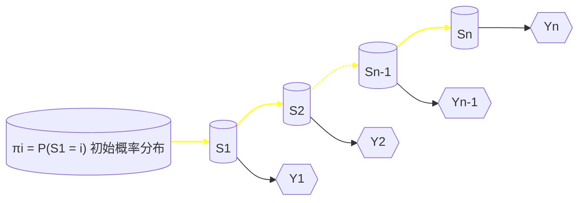

# 人工智能现代方法：机器学习

- [Intro.（一些琐碎的东西）](#intro)
- [ML Basics（一份漫游指南 &amp; 一份缩略图）](#ml-basics)
- [Linear Models](#linear-models)
- [Kernel Methods &amp; SVM](#kernel-methods-svm)
- [Bayesian Classification &amp; Probabilistic Graphical Models](#bayesian-classification-&-probabilistic-graphical-models)
- [Ensemble Learning](#ensemble-learning)
- [前馈神经网络](#前馈神经网络)
- [卷积神经网络](#卷积神经网络)
- [循环神经网络](#循环神经网络)
- [无监督学习与聚类](#无监督学习与聚类)
- [采样方法](#采样方法)

## Intro.（一些琐碎的东西）

什么是机器学习：
三大要素：T、P、E
对于某种任务T、性能度量P，一个及其程序被认为可以从经验E中学习指：利用经验E，它在任务T上由性能度量P衡量的性能提升。
T：智能系统执行的、实现目标的工作 或 智能系统处理一个样本（对象中已量化特征）的工作。
	e.g.分类、输入缺失分类、回归、转录、翻译、结构输出（输出变量之间关系）、异常检测、合成和采样、缺失值填补、去噪、密度估计
P：性能度量用来描述机器学习算法能力，与任务相关，不一定能精确定义其性能度量。
	e.g.分类正确率，概率估计，
E：经验是人们知识积累、经验就是数据集，数据点的集合

---

## ML Basics（一份漫游指南 & 一份缩略图）

学好《机器学习》这门课，与其说是学会使用一种工具，倒不如说是将一种思想内化于心——机器学习的思想。

我被告知，这些思想并非凭空产生，亦非前辈们“一拍脑门”想出的，更不是带有强烈主观色彩的人为规定。因此，这带给我们一个好消息：要真正领会这些思想，并知晓它们从何而来，我们还得从它们的数学根基入手（这是一个相当简明的抓手）。

这是因为，数学给予我们形式化定义一门语言的能力，而机器学习正是这样一门语言，它充当着沟通数据科学与人工智能“两岸”的桥梁。

---

### 前置知识 & Toolbox

#### 矩阵与优化

##### 数据的维度（tensorflow中的ternsor）

##### 数据的性态

*核心是相似度*

##### 优化方法

*主要是矩阵解析法和梯度下降方法*
**第三章线性模型中的梯度的求解与迭代公式中的最后一项转置问题存在前后不一致的问题**

关于矩阵求导的知识梳理：

#### 概率与信息

##### 我们为什么需要引入概率

##### 概率论，你熟练掌握了吗？（基于概率模型的一点补充）

> Notation:
> PDF 概率密度函数
> PMF 概率质量函数
> CDF 累积分布函数

先祭出来正态分布的公式：

$$
若x \thicksim N(\mu,\sigma^2)，则x的PDF表示为\frac{1}{\sqrt{2\pi \sigma^2}}exp(-\frac{(x-\mu)^2}{2\sigma^2})
$$

以下内容重在数学推导与求解：

###### MLE

$\theta_{MLE}=arg max_\theta p(x|\theta)$
MLE 选择使得观测数据在给定模型下最有可能发生的参数值
MLE 是 MAP 的一个特例。当先验分布 p(θ) 是均匀分布时，MAP 估计等同于 MLE。

###### CMLE

$\theta_{CMLE}=arg max_\theta p(x|y,\theta)$
CMLE 主要应用于涉及条件分布的情景下，如条件概率图模型等
在无条件信息时，CMLE 退化为 MLE。

###### MAE

$\theta_{MAP}=arg max_\theta p(x|\theta)p(\theta)$
最大后验估计结合了似然函数和先验分布，通过贝叶斯定理，寻找最大化后验概率的参数值。MAP 估计考虑了先验知识，有助于在数据稀缺或噪声较大的情况下提高估计的稳定性。

##### 信息论（一门学科的入门水平）

> 在机器学习中用来描述概率分布或量化概率分布之间的相似性

信息熵是信息量的期望，就是平均而言发生一个事件我们得到信息量的大小

交叉熵：定义于两个概率分布之上，反映两个概率分布的差异程度。

交叉熵是用来衡量在给定的真实分布下，使用非真实分布所指定的策略消除系统的不确定性所需要付出的努力的大小。

``机器学习时候要拟合分布，所以可以用交叉熵构造损失函数。``

kullback leibler(KL)散度/相对熵/信息增益：用于衡量两个概率分布之间的差距。
相对熵 = 某个策略的交叉熵（p->q付出努力大小） - 信息熵(p平均信息量)

``交叉熵是相对熵的一种特殊情况,即p(x)分布是已知的,因而导致公式的后半部分为常数项。``

##### 一些 artificial 的评价工具

*交叉熵、散度什么的*

###### 交叉熵

- 非对称

###### KL散度（相对熵/信息增益）

- 非对称
- 相对熵 = 交叉熵 - 自信息

###### JS散度

- 对称

#### 讲ML都会讲的一些东西

##### 过/欠拟合分析

过拟合：

1. 模型过于复杂

> 模型的容量：拟合函数的能力

1. 训练样本太少
2. 样本噪声太大

欠拟合：

1. 模型过于简单/特征数太少

##### 一切从评价入手

*各种指标、标志等大杂烩*

###### P-R曲线

P is for Precision（查准率）：你认为对的样本，有多少是对的
R is for Recall（查全率）：所有对的样本，你找出来了多少

P & R：反相关；我们希望二者都保持在较高的水平
因此，取 P = R 作为BEP（平衡点），作为综合考虑二者的依据
此外，F度量即为二者的（加权）调和平均

###### ROC（受试者工作特征曲线）

TPR is for True Positive Rate（真正例率）：**与查全率R相等！！！**
FPR is for False Positive Rate（假正例率）：所有反例中被你错误地预测为正例的比例

TPR & FPR：正相关；我们希望TPR维持在较高水平而FPR维持在较低水平

> 共同点：

1. 曲线与坐标轴间的包络面积反映模型的整体性能(AUC)
2. 动态调整阈值以控制对于曲线上每一坐标点的plot

> 不同点：

1. P-R曲线更适用于不平衡数据集；ROC更适用于平衡数据集

##### 一些分类

*不同分类标准*

###### 有监督学习算法的分类

**判别模型**

对于判别式模型来说求得P(Y|X)，对未见示例X，根据P(Y|X)可以求得标记Y，即可以直接判别出来，如上图的左边所示，实际是就是直接得到了判别边界，所以传统的、耳熟能详的机器学习算法如线性回归模型、支持向量机SVM等都是判别式模型，这些模型的特点都是输入属性X可以直接得到Y（对于二分类任务来说，实际得到一个score，当score大于threshold时则为正类，否则为反类）~（根本原因个人认为是对于某示例X_1，对正例和反例的标记的条件概率之和等于1，即P(Y_1|X_1)+P(Y_2|X_1)=1）

**生成模型**

而生成式模型求得P(Y,X)，对于未见示例X，你要求出X与不同标记之间的联合概率分布，然后大的获胜，如上图右边所示，并没有什么边界存在，对于未见示例（红三角），求两个联合概率分布（有两个类），比较一下，取那个大的。机器学习中朴素贝叶斯模型、隐马尔可夫模型HMM等都是生成式模型，熟悉Naive Bayes的都知道，对于输入X，需要求出好几个联合概率，然后较大的那个就是预测结果~（根本原因个人认为是对于某示例X_1，对正例和反例的标记的联合概率不等于1，即P(Y_1,X_1)+P(Y_2,X_1)<1，要遍历所有的X和Y的联合概率求和，即sum(P(X,Y))=1

**Sample**
判别式模型举例：要确定一个羊是山羊还是绵羊，用判别模型的方法是从历史数据中学习到模型，然后通过提取这只羊的特征来预测出这只羊是山羊的概率，是绵羊的概率。生成式模型举例：利用生成模型是根据山羊的特征首先学习出一个山羊的模型，然后根据绵羊的特征学习出一个绵羊的模型，然后从这只羊中提取特征，放到山羊模型中看概率是多少，在放到绵羊模型中看概率是多少，哪个大就是哪个。细细品味上面的例子，判别式模型是根据一只羊的特征可以直接给出这只羊的概率（比如logistic regression，这概率大于0.5时则为正例，否则为反例），而生成式模型是要都试一试，最大的概率的那个就是最后结果~

**要求掌握一些具体例子**
Discriminative：
涉及概率论的系列模型
HMM等图/网络模型及其变体

Generative：
决策/回归等经典算法
神经网络

###### 弱监督学习分类

1. 不完全监督（部分数据标签缺失）
2. 不确切监督（标签粗粒度，不够精细）
3. 不精确监督（部分标签错误，指鹿为马）

---

## Linear Models

> **参数**的存在形式为线性的模型
> 允许引入**非线性基函数**对输入***x***进行变换

> 区分线性模型与线性函数这组概念

#### 基函数的作用

- 提高模型的表征能力
- 对原始数据进行某种特征提取 / 特征变换

| 基函数     | 形式                                                  |
| ---------- | ----------------------------------------------------- |
| 恒等基函数 | $\phi(x) = x$                                       |
| 幂基函数   | $\phi_j(x) = x^j$                                   |
| 高斯基函数 | $\phi_j(x) = exp\{-\frac{(x-\mu_j)^2}{2s^2}\}$      |
| 反曲基函数 | $\phi_j(x) = \frac{1}{1 + exp(-\frac{x - \mu}{s})}$ |

### 线性模型用于回归问题

- 模型的求解

1. 解析法

> 利用矩阵进行最大似然估计

ps. 平方和误差函数的构造的一致性

1. 迭代法

> 随机梯度下降法（SGD法）

递推公式

#### 拓展：多输出

两种思路：

- 不同基函数进行独立单输出回归
- 联合回归模型 + 多维高斯模型

> 如果输出之间相对独立，或者每个输出的数据特性差异较大，第一种方法可能更合适。而如果输出之间存在较强的相关性，或者希望模型具有较高的计算效率，第二种方法则可能更优。

### 线性模型用于分类问题

> 不同之处在于引入**判别函数**进行后处理

#### 判别函数的作用：划定决策边界

### 判别函数（学习）方法（K类判别式法）

1. 最小平方和误差
2. Fisher线性判别式
3. Perceptron Algorithm

#### 概率模型 的 引入

> 概率模型按照x与y的分布划分为：判别式模型（给定x条件下y的概率）和生成式模型（估计x和y的联合分布）

### 逻辑回归模型

1. 解析法

> 最大似然估计法

1. 迭代法

**最难算法：IRLS**

> Iterative Reweighted least Squares算法（牛顿-拉夫森迭代）

补充知识：海森矩阵

$$
\mathbf{H} = \frac{\partial^2E(\mathbf{w})}{\partial \mathbf{w}}
$$

#### 拓展：多类回归

#### 生成模型 的 引入

---

## Kernel Methods & SVM

#### 决策边界的进一步优化：最大间隔分类器

基本定义：

> 1. 间隔：决策边界和任意样本点之间的最小距离
>
>    > 推导：任意向量x到决策平面的有符号垂直距离
>    > $$r=\frac{\mathbf{w}^T\mathbf{x}+w_0}{||\mathbf{w}||}$$
>    >
> 2. 支撑向量：确定间隔位置的*关键*样本点

### **SVM的的对偶问题：最大间隔优化**

- 二分类器的求解（拉格朗日方程法）
  1. 优化函数：最大化间隔
  > 在n个数据点中，找到距离最小的那个点，并尽可能使该点距离最大
  2. 约束条件：确保全部分类正确

#### 实际情况：样本交错的处理

两种思路：

- 软间隔：松弛变量 + 惩罚因子（penalty）
- 核函数 + 非线性变换（*详见后文*）

#### 拓展：多分类SVM
> 将样本分为k类

两种实现方式：
- $k$ 个分类器 （存在问题：分类器独立；样本不均衡）
- $k(k-1)/2$ 个分类器

#### **SVM用于回归**
引入 $\epsilon-insensitive$

#### 核方法 的 引入

> 从原始空间到特征空间的升维映射

| Kernel     | 形式                                                                    |
| ---------- | ----------------------------------------------------------------------- |
| 多项式核   | $k(\mathbf{x},\mathbf{y}) = (\mathbf{x}^T\mathbf{y} + c)^M $          |
| 高斯核     | $k(\mathbf{x},\mathbf{y}) = exp[-\frac{\Vert x-y\Vert^2}{2\sigma^2}]$ |
| 拉普拉斯核 | $k(\mathbf{x},\mathbf{y}) = exp[-\frac{\Vert x-y\Vert}{\sigma}]$      |
| 反曲核     | $k(\mathbf{x},\mathbf{y}) = tanh(a\textbf{x}^T\textbf{y} + b) $       |

- 基于已有核构造核函数的系列方法

#### 核方法的推广

---

## Bayesian Classification & Probabilistic Graphical Models

[关于贝叶斯分类器的前置知识](#概率与信息)

### 分类器的两种实现

1. 朴素实现——朴素贝叶斯分类器
2. 高级实现——概率图模型
> Motivation:随机变量多且复杂；概率图模型直观简便且计算可视化
> also 条件独立性的重要意义

关于图论的前置知识：

- 有向图(a.k.a. *贝叶斯网络*)
- 无向图 (a.k.a. *MRF-马尔可夫随机场*)
- 团
- 最大团
- 势函数
- 条件独立性

#### 重点考察方法：D 分离 & 条件移除

##### 尾到尾节点（分支）

##### 头到尾节点（串联）

##### 头到头节点（合流）

##### 一句话理解 D 分离

#### 图模型中推理概念的理解

#### 马尔可夫随机场

关于随机场的前置知识：

- 位点空间
- 相空间
- 随机场
- 邻域系统

> 吉布斯分布
>
> - 能量函数
> - 配分函数

#### 引入状态空间——走向隐马尔可夫模型

##### 解决三个基本问题

###### 前向算法
定义前向变量：*t时刻的状态* 与 *t时刻及其之前全部观测序列的联合概率*
初始化
递归
算法复杂度

###### **维特比算法**

###### EM算法

#### Everything in a Nutshell

**视频中人的注意力推理**
**——事件和物体联合识别的4D时空交互**

### 背景
这个公式的目的是用来描述在一个视频中，我们如何根据观察到的内容（比如一个人的行为）推断出这个人注意力的变化过程。

### 公式的各个部分

1. **初始状态**：
   - \( p(l_1) \) 是对一开始隐藏状态 \( l_1 \) 的猜测。隐藏状态可能表示一些我们不能直接看到的东西，比如人的心理状态。
   - \( p(y_1 | l_1) \) 是在隐藏状态 \( l_1 \) 下，注意力状态 \( y_1 \) 的概率。注意力状态是我们关心的东西，比如这个人一开始在看哪里。

2. **观测概率**：
   - 视频帧 \( x_t \) 是我们在第 \( t \) 时刻看到的画面。
   - \( \varphi(x_t) \) 是视频帧的特征，比如说画面中的人正在做什么。
   - \( p(\varphi(x_t) | l_t, y_t) \) 是在隐藏状态 \( l_t \) 和注意力状态 \( y_t \) 下，看到这些特征的概率。这部分告诉我们，在某个特定的心理状态和注意力状态下，我们有多大可能看到这个人正在做的事情。

3. **状态转移**：
   - \( p(l_t | l_{t-1}) \) 是前一个隐藏状态 \( l_{t-1} \) 转移到当前隐藏状态 \( l_t \) 的概率。
   - \( p(y_t | y_{t-1}, l_{t-1}) \) 是在前一个注意力状态 \( y_{t-1} \) 和隐藏状态 \( l_{t-1} \) 下，转移到当前注意力状态 \( y_t \) 的概率。这部分描述了注意力和隐藏状态如何随时间变化。

### 组合这些概率
将这些部分组合起来，我们得到整个过程的联合概率：

\[ p(X, l, y) = p(l_1) p(y_1 | l_1) \prod_{t=1}^T p(\varphi(x_t) | l_t, y_t) \prod_{t=2}^T p(l_t | l_{t-1}) \prod_{t=2}^T p(y_t | y_{t-1}, l_{t-1}) \]

这个公式的每一部分都在说明一个方面的情况：

- **初始状态和初始注意力状态**：一开始的猜测。
- **每一帧的观测**：我们看到的每一帧视频在给定状态下有多大可能性。
- **状态转移**：状态和注意力状态如何从一个时间步转移到下一个时间步。

### 举个例子

假设我们在看一个视频，视频中的人从走到水杯那里、检查水杯的状态、然后查看书的状态。这三个动作依次发生。

1. **初始状态**：我们猜测这个人最开始在寻找水杯。
2. **观测概率**：我们看到视频帧中这个人确实在看水杯，这符合我们对他注意力的猜测。
3. **状态转移**：从看水杯到检查水杯的状态，然后再转移到查看书的状态。

通过这种方法，我们可以一步步地根据视频中的画面来推测出人的注意力状态变化，并计算出每一步的可能性。这就是这个公式的主要作用：帮助我们理解和计算一个复杂过程中的各个状态和观察结果的关系。
## Ensemble Learning

Classification：

- 同质：基学习器
- 异质：组件学习器

集群与性能的关系：

### Boosting

> 依赖 / 串行

#### 机制

特点：

#### 典型算法

注意：

#### 应用

### Bagging or Random Forest

> 不依赖 / 并行

#### 机制

特点：

#### 典型算法：Decision Tree

##### 构建分类树

#### Random Forest

#### 应用

## 前馈神经网络

> Feedforward NN / MLP
> 结构：网络中的变量和它们的拓扑关系
> 激励函数：神经元如何根据其他神经元的活动改变自己的激励值
> 学习规则: 网络中权重如何随着时间推进而调整

### 构建$\phi$的三种方式（ML关注的问题）

1. 通过映射，将$x$变换至无限维空间$\phi(x)$
2. 手动设计$\phi$,以人的经验选择特征，如边缘、HOG、SIFT
3. 自主学习$\phi$,从数据中挖掘和学习实现某一任务最佳$\phi(x)$（*因此DL属于ML的子类*）

### 普遍近似原理
牢记几个关键词：
- “挤压”非线性激活函数 -> 线性输出层
- 足够数量的隐藏单元
- 任意精度近似
- 从一个**有限维空间**到另一个**有限维空间**

### 激活函数

### 代价函数

### 输出单元

### 架构设计
> 默认：输入层即为神经网络的第0层
$f(x)=f^{(3)}(f^{(2)}f^{(1)}(x))$ -> 包含2个隐藏层和一个输出层的神经网络

## 卷积神经网络

> 理解：卷积神经网络引入卷及操作，可以对于局部数据提取特征（局部感知），并且可以对同一数据进行多种卷积得到不同特征（参数共享），最后对于得到的特征在不改变特征情况下进行降维（池化）
> ‘端到端’：卷积神经网络通过卷积操作、池化操作、非线性激活函数映射等一系列操作的层层堆叠，将高层语义信息逐层由原始数据输入层中提取出来，逐层抽象，知道完成目标任务。

### 定义

### 特点

### 结构
**Pipeline**
CONV->ReLU->POOL->CONV->ReLU->POOL->……->FC

### 卷积单元

#### 局部感知域

#### 参数共享

#### 激活函数
1. $Sigmoid(x)=\frac{1}{1+e^{-x}}$
1. $tanh(x)=\frac{e^x-e^{-x}}{e^x+e^{-x}}$
3. $ReLU(x)=max(0,x)$

##### 其他激活函数
1. $softmax(\mathbf{z})_i=\frac{exp(\mathbf{z}_i)}{\sum_j(\mathbf{z}_j)}$ *(习惯上把z叫做logits)*

#### 多通道卷积

#### 池化

### 全连接层

### 实例

## 循环神经网络

> 理解：通过一个隐层来确定信息是否存储，考试的时候会考LSTM的内部结构
> 区别:
> 前馈神经网络：模型输出和模型本身没有反馈连接的神经网络。容易处理网格数据，很难处理序列数据、没有长期记忆能力
> 循环神经网络：是一种具有从后续层到前面层反馈连接或者同层之间神经元连接的神经网络，常用于处理顺序数据。

### 结构

### LSTM

#### 遗忘门

#### 输入们

#### 状态更新

#### 信息输出

## 无监督学习与聚类

> 无监督学习：在无监督学习中，训练样本的标记信息是未知的，目标是通过对无标记训练样本的学习来揭示数据的内在性质及其规律，为进一步的数据分析提供基础。

### 聚类

> 聚类：是无监督学习中应用最广、研究最多的一个内容，其目的是能够自动将未标记的数据根据自身的特点划分为若干个通常是不相交的子集（“``簇（cluster）``”）。通过聚类算法，不仅可以自动组织数据，还能挖掘一些数据的隐藏结构和属性，如：“浅色瓜”,…聚类算法也可以作为其他数据处理的基础，如数据降维、可视化。

#### 应用

通过话题聚类网页；根据表达式聚类蛋白质序列；根据消费记录对客户进行分类

#### 定义

#### 性能度量

外部指标：对比聚类结果和参考模型的簇划分、聚类结果的簇标记响亮和参考模型的簇标记向量。

内部指标：基于样本间的距离和簇中心点间的距离。（样本间离得越近越好）

#### 距离计算

闵可夫斯基距离
欧氏距离
曼哈顿距离

#### 性质

非负性
对称性

### K均值聚类

### 密度聚类（DBSCAN）

#### 术语

##### 核心对象

##### 密度直达

##### 密度可达

##### 密度相连

##### 簇定义

#### DBSCAN算法

### 层次聚类

> 试图在不同层次对数据进行划分，从而形成树形的聚类结构。数据集的划分可采用“自底向上”的聚合策略，也可采用“自顶向下”的分拆策略。

#### AGNES算法

## 采样方法

> 采样定义：从一个分布中生成一批服从该分布的样本。
> 采样的本质上是对随机现象的模拟，根据给定的概率分布，来模拟产生一个对应的随机事件。采样可以让人们对随机事件及其产生过程有更直观的认识。

> 采样的作用：采样得到的样本集也可以看做是一种非参数模型，即用较少的样本点（经验分布）来近似总体分布，并刻画总体分布中的不确定性。从这个角度来讲采样其实也是一种信息的降维，起到简化问题的作用。
> 在机器学习中，可能会遇到样本量过大或模型结构复杂导致的求解难度大、没有显示解析解等问题，这种情况下，可以利用采样方法进行模拟，从而对这些复杂模型进行近似求解或推理。一般会转化为**某些函数在特定分布下的积分或期望**，或者是求某些随机变量或参数**在给定数据下的后验分布**。

### 蒙特卡罗方法

### 常见的采样方法

#### 均匀分布采样

#### 逆变换采样

#### 拒绝采样

#### 重要采样

#### Metropolis-Hastings方法

#### Gibbs采样
