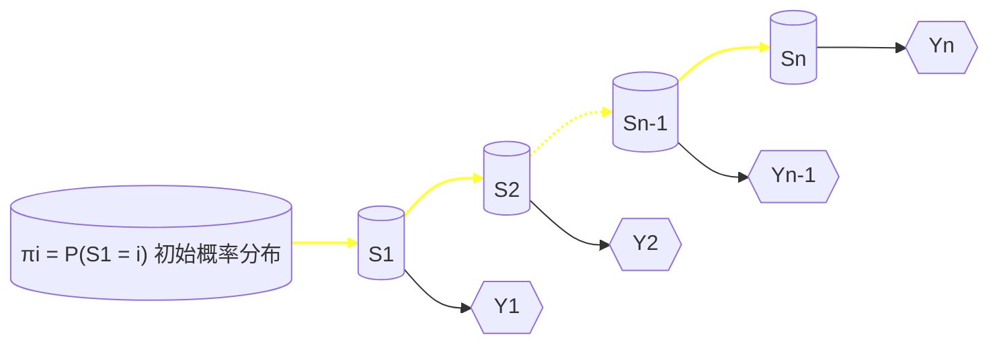

# 人工智能现代方法：机器学习
- [Intro.（一些琐碎的东西）](#intro)
- [ML Basics（一份漫游指南 & 一份缩略图）](#ml-basics)
- [Linear Models](#linear-models)
- [Kernel Methods & SVM](#kernel-methods-svm)
- [Bayesian Classification & Probabilistic Graphical Models](#bayesian-classification-&-probabilistic-graphical-models)

## Intro.（一些琐碎的东西） {#intro}

***

## ML Basics（一份漫游指南 & 一份缩略图） {#ml-basics}

学好《机器学习》这门课，与其说是学会使用一种工具，倒不如说是将一种思想内化于心——机器学习的思想。

我被告知，这些思想并非凭空产生，亦非前辈们“一拍脑门”想出的，更不是带有强烈主观色彩的人为规定。因此，这带给我们一个好消息：要真正领会这些思想，并知晓它们从何而来，我们还得从它们的数学根基入手（这是一个相当简明的抓手）。

这是因为，数学给予我们形式化定义一门语言的能力，而机器学习正是这样一门语言，它充当着沟通数据科学与人工智能“两岸”的桥梁。

***

### 前置知识 & Toolbox

#### 矩阵与优化

##### 数据的维度（tensorflow中的ternsor）
##### 数据的性态
*核心是相似度*
##### 优化方法
*主要是梯度下降方法*

#### 概率与信息 {#概率与信息}

##### 我们为什么需要引入概率
##### 概率论，你熟练掌握了吗？（基于概率模型的一点补充）
*最大似然估计放在这里*
##### 信息论（一门学科的入门水平）
##### 一些 artificial 的评价工具
*交叉熵、散度什么的*

#### 讲ML都会讲的一些东西

##### 一切从评价入手
*各种指标、标志等大杂烩*
##### 一些分类
*不同分类标准*

***

## Linear Models {#linear-models}
> **参数**的存在形式为线性的模型
> 允许引入**非线性基函数**对输入***x***进行变换

> 区分线性模型与线性函数这组概念

#### 基函数的作用
- 提高模型的表征能力
- 对原始数据进行某种特征提取 / 特征变换

| 基函数    | 形式 |
| ----------- | ----------- |
| 恒等基函数   | $\phi(x) = x$      |
| 幂基函数  | $\phi_j(x) = x^j$     |
| 高斯基函数 |   $\phi_j(x) = exp\{-\frac{(x-\mu_j)^2}{2s^2}\}$        |
| 反曲基函数 | $\phi_j(x) = \frac{1}{1 + exp(-\frac{x - \mu}{s})}$          |

### 线性模型用于回归问题
- 模型的求解
1. 解析法
> 利用矩阵进行最大似然估计

ps. 平方和误差函数的构造的一致性

1. 迭代法
> 随机梯度下降法（SGD法）

递推公式
#### 拓展：多输出
两种思路：
- 不同基函数进行独立单输出回归
- 联合回归模型 + 多维高斯模型
> 如果输出之间相对独立，或者每个输出的数据特性差异较大，第一种方法可能更合适。而如果输出之间存在较强的相关性，或者希望模型具有较高的计算效率，第二种方法则可能更优。

### 线性模型用于分类问题
> 不同之处在于引入**判别函数**进行后处理
#### 判别函数的作用：划定决策边界
### 判别函数（学习）方法（K类判别式法）
1. 最小平方和误差
1. Fisher线性判别式
1. Perceptron Algorithm

#### 概率模型 的 引入
> 概率模型按照x与y的分布划分为：判别式模型（给定x条件下y的概率）和生成式模型（估计x和y的联合分布）
### 逻辑回归模型
1. 解析法
> 最大似然估计法

1. 迭代法
> Iterative Reweighted least Squares算法（牛顿-拉夫森迭代）
#### 拓展：多类回归

#### 生成模型 的 引入

***

## Kernel Methods & SVM {#kernel-methods-svm}
#### 决策边界的进一步优化：最大间隔分类器
基本定义：
> 1. 间隔：决策边界和任意样本点之间的最小距离
> 1. 支撑向量：确定间隔位置的*关键*样本点

### 最大间隔优化
- 二分类器的求解（拉格朗日方程法）
    1. 优化函数：最大化间隔
    1. 约束条件：确保全部分类正确

#### 实际情况：样本交错的处理
两种思路：
- 软间隔：松弛变量 + 惩罚因子（penalty）
- 核函数 + 非线性变换（*详见后文*）

#### 拓展：多分类SVM

#### 拓展：SVM用于回归

#### 核方法 的 引入
> 从原始空间到特征空间的升维映射

| Kernel   | 形式 |
| ----------- | ----------- |
| 多项式核   | $k(\mathbf{x},\mathbf{y}) = (\mathbf{x}^T\mathbf{y} + c)^M $    |
| 高斯核  | $k(\mathbf{x},\mathbf{y}) = exp[-\frac{\Vert x-y\Vert^2}{2\sigma^2}]$     |
| 拉普拉斯核 |  $k(\mathbf{x},\mathbf{y}) = exp[-\frac{\Vert x-y\Vert}{\sigma}]$      |
| 反曲核 | $k(\mathbf{x},\mathbf{y}) = tanh(a\textbf{x}^T\textbf{y} + b) $    |
- 构造一个核函数

#### 核方法的推广

***

## Bayesian Classification & Probabilistic Graphical Models {#bayesian-classification-&-probabilistic-graphical-models}
[关于贝叶斯分类器的前置知识](#概率与信息)

### 分类器的两种实现
1. 朴素实现——朴素贝叶斯分类器
1. 高级实现——概率图模型

关于图论的前置知识：
- 有向图(a.k.a. *贝叶斯网络*)
- 无向图 (a.k.a. *马尔可夫随机场*)
- 团
- 最大团
- 势函数
- 条件独立性

#### 重点考察方法：D分离 & 条件移除

#### 马尔可夫随机场
关于随机场的前置知识：
- 位点空间
- 相空间
- 随机场
- 邻域系统

> 吉布斯分布
> - 能量函数
> - 配分函数
>
>

#### 引入状态空间——走向隐马尔可夫模型

##### 解决三个基本问题
1. 
- 前向算法
1. 
- 维特比算法
1. 
- EM算法

#### Everything in a Nutshell
**视频中人的注意力推理**
**——事件和物体联合识别的4D时空交互**

## Ensemble Learning
Classification：
- 同质：基学习器
- 异质：组件学习器

集群与性能的关系：

### Boosting
> 依赖 / 串行
#### 机制
特点：
#### 典型算法
注意：
#### 应用

### Bagging or Random Forest
> 不依赖 / 并行
#### 机制
特点：
#### 典型算法：Decision Tree

##### 构建分类树

#### Random Forest

#### 应用